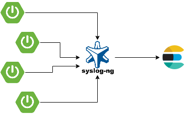

## Centralized Logging with Spring Boot and Logback and Syslog-ng and Elasticsearch

This repo demonstrate to creating a centralized logging system with Spring Boot and Logback and Syslog-ng and Elasticsearch.



You can run the elasticsearch and syslog-ng server via below commands for test;

* **Run Services**

```shell
cd docker
docker-compose up
```

* **Run Demo Application**

And then you can start the spring boot application via
```shell
./mvnw spring-boot:run
```

* **See The Logs**

And then you should send a request for create a log;
```text
http://localhost:8080/?name=dilaver%20demirel
```

And you can see logs on elasticsearch;
```text
http://localhost:9200/_cat/indices
http://localhost:9200/syslog-ng-[yyy].[mm].[dd]/_search?size=50
```

That's it ;)